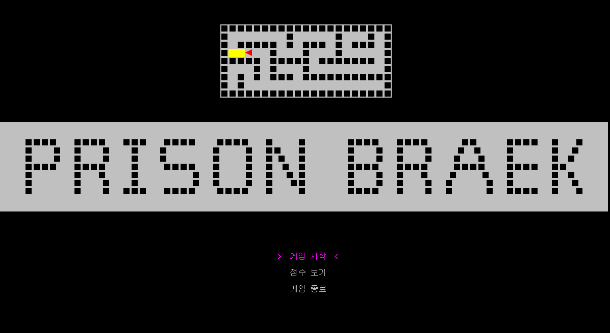
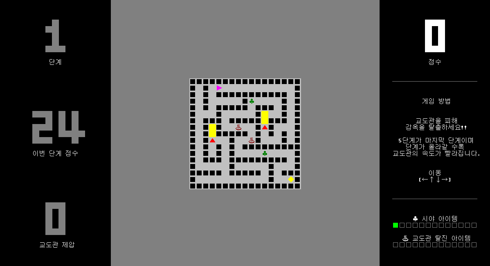
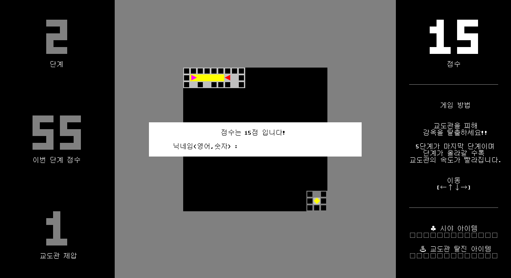

# Prison Break
교도관을 피해 감옥을 탈출하는 게임입니다. C언어로 제작했습니다. 모든 음향 소스는 [뮤팟](https://www.mewpot.com/)에서 구했습니다.

## Preview

### 인트로 화면

### 게임 진행 중 시야 아이템을 먹은 모습

### 교도관에게 적발된 모습

## Maze generating algorithm
미로 생성 알고리즘은 깊이우선탐색을 이용하였습니다. [Buckblog - Maze Generation: Recursive Backtracking](https://weblog.jamisbuck.org/2010/12/27/maze-generation-recursive-backtracking) 문서를 참고하여 구현했습니다.
